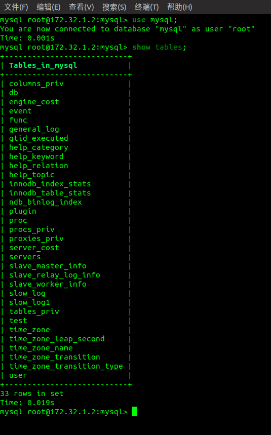
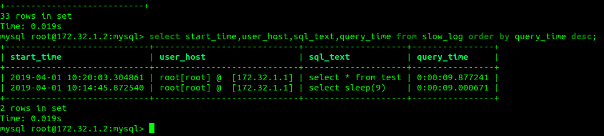

### 测试MySQL slow_log 表安全清空

### master:

my.cnf
```ini
[mysqld]

server_id=1

slow_query_log=1

long_query_time=3

log_output=TABLE

log_bin=/data/mysql/bin_log
```

### slave:
my.cnf
```ini
[mysqld]

server_id=21

slow_query_log=1

long_query_time=3

log_output=TABLE

log_bin=/data/mysql/bin_log
```

### 安全清除方案：

```sql

use mysql;

set @old_log_state=@@GLOBAL.slow_query_log;

set GLOBAL slow_log=0;

drop table if exists slow_log1;

create table slow_log_tmp like slow_log;

rename table slow_log to slow_log1, slow_log_tmp to slow_log;

set GLOBAL slow_query_log=@old_log_state;

```

### 写MySQL:

用py持续写入时，测试安全清除slow_log表方案。
```shell
python3 mysql-read-write-loop.py
```

```sql
source ./clear_slow_log_table.sql
```

 

慢查询：
```sql
select start_time,user_host,sql_text,query_time from slow_log order by query_time desc;
```


mysql-read-write-loop.py:
```python
#!/usr/bin/env python3
# coding=utf-8
# date 2019-01-25 14:00:34
# https://github.com/calllivecn

import sys
import time
import argparse
from random import randint

import pymysql

parse = argparse.ArgumentParser(add_help=False)

parse.add_argument("-h", "--host", action="store", default="localhost",help="connect host")
parse.add_argument("-u", "--user", action="store", default="root",help="connect username")
parse.add_argument("-p", "--password", action="store", default=None, help="connect username")
parse.add_argument("-P", "--port", action="store", default=3306, help="connect host port")
parse.add_argument("-D", "--database", action="store", default=None, help="connect mysql db")

args = parse.parse_args()
print(args)

try:
    con = pymysql.connect(
                        host=args.host,
                        port=args.port,
                        user=args.user,
                        password=args.password,
                        db=args.database,
                        )
except pymysql.err.Error as e:
    print("连接异常")
    print(e)
    sys.exit(1)

cursor = con.cursor()

cursor.execute("create table if not exists test(id int primary key auto_increment, random int);")

t = 0
while t <= 60:
    start = time.time()
    for _ in range(50):
        i = randint(0, 50000)
        cursor.execute("insert into test(random) values(%s);", i)
    end = time.time()
    t += (end - start)

cursor.execute("select * from test;")

print("插入数据条目", len(cursor.fetchall()))

con.commit()

cursor.close()

```